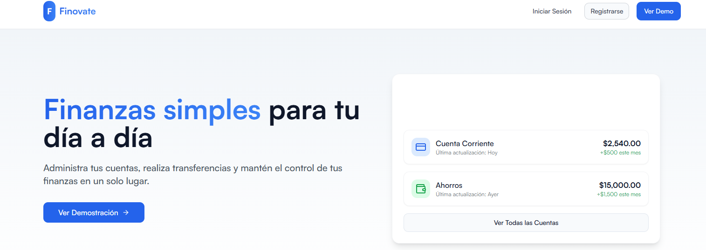
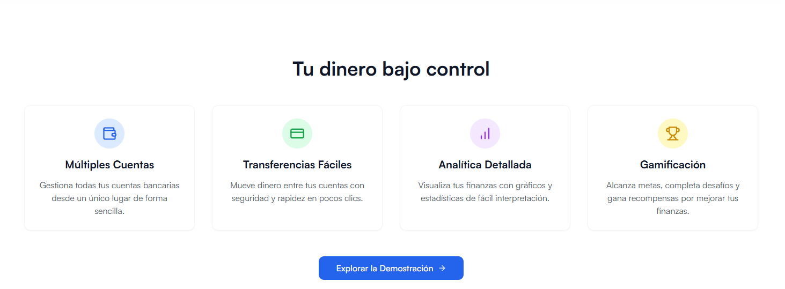
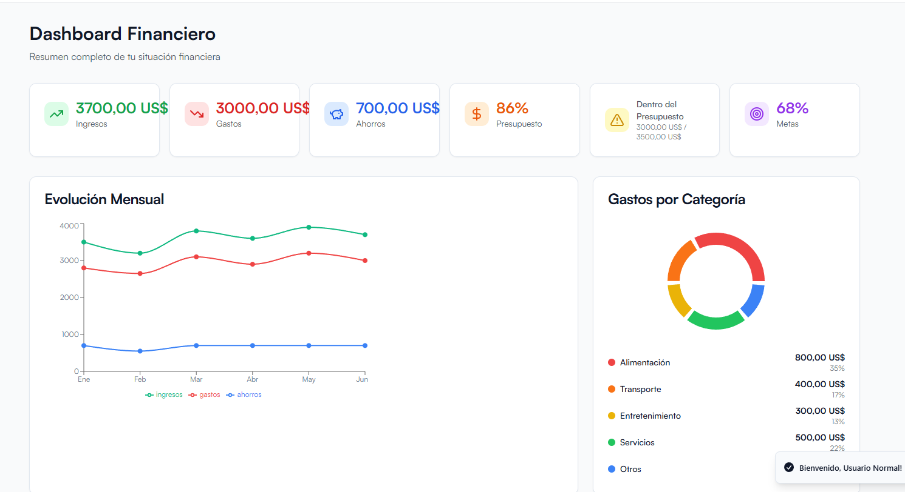

<p align="center"> <h1> Finovate </h1>

<p align="center"><i>Finovate es una aplicación web diseñada para ayudar a los usuarios a gestionar sus finanzas personales. 
El propósito principal de la aplicación es ofrecer a los usuarios un panel de control centralizado para rastrear ingresos, gastos, establecer presupuestos y obtener una visión clara de su salud financiera. </i></p>

<p align="center">
  <a href="https://finovate-six.vercel.app/" target="_blank">Demo en vivo</a> •
  <a href="#screenshots">Screenshots</a> •
  <a href="#instalación">Instalación</a> •
  <a href="#características">Características</a> •
  <a href="#tecnologías">Tecnologías</a>
</p>

## 📸 Screenshots

### Página de inicio y características principales

*La página de inicio de Finovate muestra una interfaz moderna y limpia con un panel de navegación en la parte superior, un hero section que destaca las principales funcionalidades de la aplicación, y un dashboard de ejemplo que muestra cómo se visualizan las cuentas y balances del usuario. La interfaz utiliza una paleta de colores profesional en tonos azules y púrpuras, con una distribución espaciada que facilita la lectura y navegación.*

### Dashboard financiero detallado

*El dashboard financiero proporciona una visión completa de la situación económica del usuario. Incluye tarjetas informativas que muestran los ingresos totales (3700 USD), gastos (3000 USD), ahorros (700 USD), y progreso en metas financieras (68%). También presenta gráficos visuales de evolución mensual de ingresos y gastos, así como un desglose de gastos por categoría representado en un gráfico circular. La interfaz está diseñada para permitir al usuario identificar rápidamente su situación financiera con un solo vistazo.*

### Gestión de transacciones y exportación

*La sección de gestión de transacciones muestra un historial detallado de movimientos financieros. Cada transacción incluye información como descripción, tipo (depósito, retiro, transferencia), fecha y monto. La interfaz permite filtrar transacciones, editarlas mediante el botón de lápiz, y ahora incluye una nueva f++uncionalidad para exportar las transacciones en formato JSON, tanto individualmente como en conjunto. Los usuarios pueden realizar estas acciones fácilmente a través de los botones intuitivos situados junto a cada transacción.*

## 💻 Tech Stack

<ul style="display: flex; flex-direction: column; gap:10px;">
  <li style="vertical-align: middle;">
     React
  </li>
    <li style="vertical-align: middle;">
     Typescript
  </li>
  </li>
    <li style="vertical-align: middle;">
     Tailwind
  </li>
    <li style="vertical-align: middle;">
     Vite
  </li>
  <li style="vertical-align: middle;">
     Vitest
  </li>
  <li style="vertical-align: middle;">
     Supabase
  </li>
  </li>
</ul>

## 📋 Descripción

Finovate es una solución integral para la gestión de finanzas personales que combina funcionalidad robusta con una interfaz de usuario intuitiva. La aplicación permite a los usuarios:

- Gestionar múltiples cuentas bancarias en un solo lugar
- Realizar un seguimiento detallado de ingresos y gastos
- Establecer y monitorear presupuestos personalizados
- Definir y alcanzar metas financieras
- Visualizar datos financieros mediante gráficos interactivos
- Exportar transacciones en formato JSON para uso externo

La aplicación está diseñada con un enfoque en la experiencia de usuario, ofreciendo una navegación sencilla y una visualización clara de la información financiera, ayudando a los usuarios a tomar decisiones informadas sobre sus finanzas.

## 🚀 Instalación

Para ejecutar Finovate localmente, sigue estos pasos:

```bash
# Clonar el repositorio
git clone https://github.com/samuelbonifacio015/Finovate.git
cd Finovate

# Instalar dependencias
npm install

# Iniciar el servidor de desarrollo
npm run dev

# Se mostrará un mensaje similar a este: 
-> Local: http://localhost:<direccion>/
```

## ⚡ Características

* **Panel de Control (Dashboard):** Una vista general del estado financiero del usuario, incluyendo saldos de cuentas, resúmenes de gastos y progreso hacia metas financieras.
* **Seguimiento de Ingresos y Gastos:** Capacidad para registrar y categorizar transacciones financieras, con la posibilidad de exportarlas en formato JSON.
* **Gestión de Presupuestos:** Herramientas para crear y monitorear presupuestos para diferentes categorías de gastos.
* **Establecimiento de Metas Financieras:** Funcionalidad para definir y seguir el progreso de objetivos financieros (ej. ahorros para un viaje, pago de deudas).
* **Informes y Análisis:** Generación de informes visuales (gráficos, tablas) para ayudar a los usuarios a entender sus patrones de gasto y tomar decisiones informadas.
* **Gestión de Cuentas:** Posibilidad de agregar y gestionar múltiples cuentas financieras (bancarias, tarjetas de crédito, etc.).
* **Interfaz de Usuario Intuitiva:** Diseñada para ser fácil de usar y navegar, permitiendo a los usuarios acceder rápidamente a la información que necesitan.

## 📚 Cómo Usar

### Acceso a la Demostración

Puedes acceder a la versión de demostración de Finovate sin necesidad de registro. Simplemente visita:

- **Demo:** [https://finovate-six.vercel.app/](https://finovate-six.vercel.app/)
- **Usuario demo:** Usuario (no se requiere contraseña)

### Funcionalidades Principales

1. **Dashboard:** Al ingresar, accederás al panel principal donde podrás ver un resumen completo de tu situación financiera.
2. **Transacciones:** En la sección "Transacciones" puedes agregar nuevos movimientos, filtrarlos, y exportarlos en formato JSON.
3. **Metas:** Establece objetivos financieros y haz seguimiento de tu progreso.
4. **Cuenta Demo:** Explora las funcionalidades de una cuenta bancaria de ejemplo.
5. **Perfil:** Configura tus preferencias y gestiona tu información personal.

## ⚠️ Próximas funcionalidades

* **Gamificación del ahorro:** Implementación de desafíos interactivos para fomentar el ahorro mediante elementos de gamificación, recompensas virtuales y un sistema de niveles que premie el progreso financiero del usuario.

* **Educación Financiera:** Integración de artículos, videos y consejos personalizados que se actualizarán diariamente para mejorar la experiencia de usuario y proporcionar orientación financiera adaptada al perfil de cada usuario.

* **Integración con APIs bancarias:** En desarrollo la funcionalidad para conectar con cuentas bancarias reales mediante APIs seguras, permitiendo la sincronización automática de transacciones.

## 🔒 Seguridad

Finovate prioriza la seguridad de los datos financieros:

- Todos los datos se almacenan localmente (localStorage) en la versión de demostración
- En producción, se implementarán medidas de seguridad avanzadas como:
  - Cifrado de extremo a extremo
  - Autenticación de dos factores
  - Cumplimiento con estándares de seguridad financiera

## Credits

Template created with [lovable.dev](https://lovable.dev). 
Made with ❤️ by [samuelbonifacio015](https://github.com/samuelbonifacio015). 